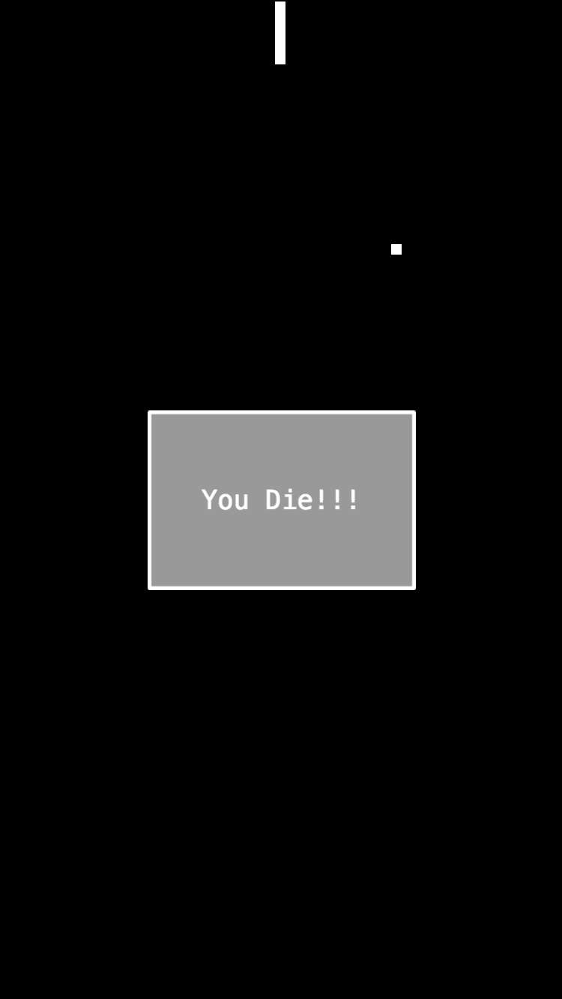

# Snake Game

基于 [Egret][1] 编写的贪吃蛇小游戏，画面简单，操作容易。

### 界面

先把游戏界面摆出来，然后大家再根据自己的审美决定要不要去下一步把玩

蛇在动：


蛇死了：



### 把玩

> 本地需要安装 Egert，并且命令已添加到环境变量，可参考[这里][2]

克隆项目到本地：

```bash
➜ git clone https://github.com/Chen38/snake.git
```

进入目录后运行：

```bash
# 端口号随便自己设定，不冲突就好
➜ egret startserver --port 1234 -a
```

> `-a` 表示保存文件之后自动编译

### 操作

页面打开后贪吃蛇就自动开始了

主要按键：

|    按键    |   功能    |
|  :------: | :-----: |
| `W` / ⬆️  |   Up    |
| `D` / ➡️  |  Right  |
| `S` / ⬇️  |  Down   |
| `A` / ⬅️  |  Left   |
|  Space    | Restart |

> 长按方向键可加速

### 技术

- TypeScript

### To Do List

- [ ] 边界的碰撞检查不是很好
- [ ] Transform to 3D

<!-- Links -->

[1]: http://developer.egret.com/cn/
[2]: http://developer.egret.com/cn/github/egret-docs/Engine2D/projectConfig/installation/index.html
